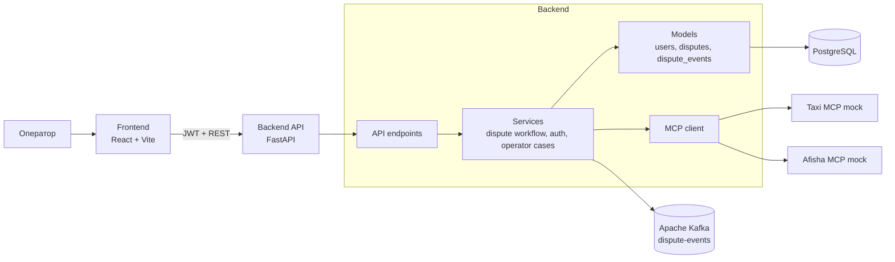

# dispute_mcp_processing

Сервис обработки диспутов НСПК: парсинг текста, определение сервиса (Такси / Афиша), запрос к MCP, формирование ответа оператору.

## Команда

| Имя | Роль | GitHub | Доступность | Отчёт |
|--------------------|-------------------------|------------------------------------------|------------|--------|
| Анна Милютина | Аналитика | [millana4](https://github.com/millana4) | 9:00 — 21:00 | [отчёт](reports/anna-milyutina.md) |
| Иван Людвиков | Разработка | [Vanusha61](https://github.com/Vanusha61) | 9:00 — 22:00 | [отчёт](reports/ivan-lyudvikov.md) |
| Артём Царюк | Тимлид | [funcid](https://github.com/funcid) | 18:00 — 21:00 | [отчёт](reports/artyom-tsaryuk.md) |
| Абида Аюшиев | Тестировщик | [ayutoso28](https://github.com/ayutoso28) | 9:00 — 22:00 | [отчёт](reports/abida-ayushiev.md) |
| Альбина Шустова | Разработка | [AlbinaShu](https://github.com/AlbinaShu) | 12:00 — 23:00 | [отчёт](reports/albina-shustova.md) |

Сводка по всем участникам: [reports/README.md](reports/README.md).

## Функции

* `POST /api/v1/disputes/process` — обработка текста диспута.
* Парсинг: `transaction_id`, `order_id`, `user_id`, `service_hint`.
* Классификация сервиса: правила, при необходимости LLM (GigaChat).
* MCP: один коннектор на диспут (taxi / afisha).
* Mock MCP: Такси (поездка), Афиша (билет/событие).
* Статусы кейса в UI: `new`, `processing`, `attention`, `resolved`.
* Auth: JWT, `POST /login`, `PATCH /change-password`, admin API для пользователей.
* Идемпотентность: заголовок `Idempotency-Key`, hash нормализованного текста.
* Таблицы `disputes`, `dispute_events`; HMAC-подпись событий.
* Публикация событий в Kafka (`dispute-events`) после commit в БД.
* Блокировка диспута: `version`, `assigned_to`, `locked_until`; `claim` / `status` с `expected_version`.
* Операторский UI: `GET /api/v1/operator/cases` и действия parse / mcp / result.

## Стек

| Слой | Технологии |
|------|------------|
| Backend | Python, FastAPI, SQLAlchemy, Pydantic, Uvicorn, aiokafka |
| Frontend | React, TypeScript, Vite |
| БД | PostgreSQL |
| Очередь | Apache Kafka |
| MCP | MCP SDK, mock-серверы taxi / afisha |
| Тесты | pytest, pytest-asyncio, Vitest |
| Сборка | Docker, Docker Compose |

## Структура репозитория

```text
backend/
  app/
    api/             # HTTP-ручки, router и DTO
    core/            # конфигурация, БД, авторизация, логирование
    llm/             # клиент LLM и prompt fallback-классификатора
    mcp/             # общий MCP-клиент
    models/          # SQLAlchemy-модели
    services/        # бизнес-логика диспутов, событий и пользователей
  mcp_servers/       # mock MCP-серверы Такси и Афиша
  tests/             # backend-тесты
  requirements.txt
  pytest.ini
frontend/
  src/
    components/      # UI-компоненты рабочего места оператора
    features/
      auth/           # авторизация оператора
      disputes/       # API и helper-логика диспутов
      workspace/      # состояние рабочего места оператора
    shared/           # общий HTTP-клиент
    App.tsx
devops/
  Dockerfile
  docker-compose.yml
docs/
  openapi.yaml
reports/             # отчёты участников по коммитам
.github/
  workflows/ci.yml
```

## Запуск

### Docker Compose (backend, PostgreSQL, Kafka, frontend, MCP mocks)

```bash
docker compose -f devops/docker-compose.yml up --build
```

| Сервис | URL |
|--------|-----|
| Backend API | http://localhost:8000 |
| Swagger | http://localhost:8000/docs |
| Frontend | http://localhost:5173 |
| Taxi MCP mock | http://localhost:9001 |
| Afisha MCP mock | http://localhost:9002 |

Учётная запись по умолчанию (seed): `operator` / `operator123` (переменные `SEED_OPERATOR_USERNAME`, `SEED_OPERATOR_PASSWORD`).

### Frontend отдельно

```bash
cd frontend
npm install
npm run dev
```

Переменная `VITE_API_BASE_URL` (по умолчанию `http://localhost:8000/api/v1`).

### Тесты backend

```bash
cd backend
pip install -r requirements.txt
python -m pytest
```

### Сборка frontend

```bash
cd frontend
npm run build
```

## API

Спецификация: [docs/openapi.yaml](docs/openapi.yaml).

```bash
curl -X POST http://localhost:8000/api/v1/disputes/process \
  -H "Content-Type: application/json" \
  -H "Authorization: Bearer <token>" \
  -H "Idempotency-Key: DSP-TXN-98765" \
  -H "X-Correlation-Id: demo-correlation-id" \
  -d "{\"text\":\"От НСПК поступил диспут: transaction_id=TXN-98765, order_id=TAXI-240518. Клиент сообщает, что поездка не состоялась, но оплата списана.\"}"
```

Ответ `200`:

```json
{
  "dispute_id": "uuid",
  "idempotency_key": "DSP-TXN-98765",
  "replayed": false,
  "status": "resolved",
  "parsed": {
    "order_id": "TAXI-240518",
    "transaction_id": "TXN-98765",
    "user_id": null,
    "service_hint": null
  },
  "nlu": {
    "service": "taxi",
    "confidence": 70,
    "source": "rules"
  },
  "mcp": {
    "service": "taxi",
    "status": "found"
  },
  "result": "Транзакция TXN-98765 подтверждена. Поездка по заказу TAXI-240518 не состоялась, списание подлежит возврату клиенту."
}
```

## Надежность обработки

* **Идемпотентность:** повтор с тем же `Idempotency-Key` или тем же нормализованным текстом возвращает уже сохраненный результат и пишет событие `dispute.replayed`.
* **Eventual consistency:** обработка пока выполняется синхронно внутри API, но состояние уже хранится как `accepted -> processing_started -> resolved/attention`, а события после фиксации в БД публикуются в Apache Kafka topic `dispute-events`.
* **Безопасность событий:** каждое событие в `dispute_events` имеет монотонный `sequence`, уникальный в рамках диспута, и подписывается HMAC на основе `EVENT_SIGNATURE_SECRET`, `sequence`, `payload`, `event_type`, `producer` и `correlation_id`.
* **Защита от одновременной работы операторов:** у диспута есть `version`, `assigned_to` и `locked_until`. Оператор должен сначала вызвать `POST /api/v1/disputes/{id}/claim` с `expected_version`, после чего изменения статуса выполняются через `PATCH /api/v1/disputes/{id}/status` также с `expected_version`.
* **Optimistic locking:** если другой оператор уже изменил кейс, версия не совпадет и API вернет `409 Conflict` вместо перезаписи данных.
* **Статусная машина:** разрешены только контролируемые переходы `accepted -> processing/attention/resolved`, `processing -> attention/resolved`, `attention -> processing/resolved`. Завершенный `resolved` кейс нельзя забрать или изменить.
* **Аудит:** таблицы `disputes` и `dispute_events` позволяют восстановить результат обработки и историю решений.

## Общая архитектура



### Поток обработки диспута

1. Оператор авторизуется через `POST /api/v1/login` и получает JWT.
2. Frontend получает рабочую очередь из `GET /api/v1/operator/cases`.
3. Backend выполняет парсинг, классификацию сервиса и обращение к нужному MCP-адаптеру.
4. Для реальной обработки диспута используется durable workflow: `disputes` + `dispute_events`, идемпотентность, HMAC-подписи событий и optimistic locking.
5. После фиксации события в БД backend публикует его в Apache Kafka topic `dispute-events` для асинхронных consumers.
6. Frontend отображает результат и журнал действий, но не хранит бизнес-логику обработки.
