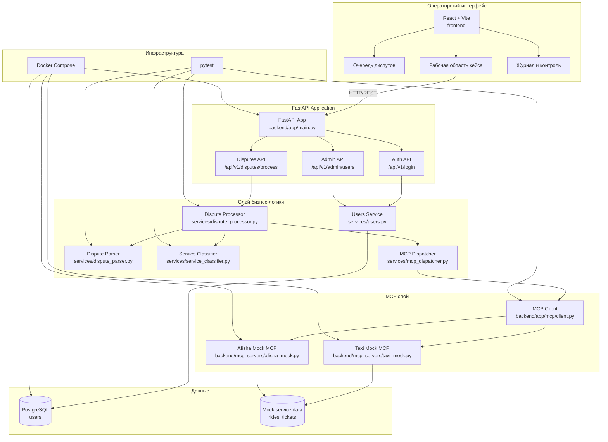

# dispute_mcp_processing

## Команда

| Имя | Роль | GitHub | Доступность | Отчет |
|--------------------|-------------------------|------------------------------------------|------------|-------|
| Анна Милютина | Аналитика | [millana4](https://github.com/millana4) | 9:00 — 21:00 | Отчет |
| Иван Людвиков | Разработка | [Vanusha61](https://github.com/Vanusha61) | 9:00 — 22:00 | Отчет |
| Артём Царюк | Тимлид | [funcid](https://github.com/funcid) | 18:00 — 21:00 | Отчет |
| Абида Аюшиев | Тестировщик | [ayutoso28](https://github.com/ayutoso28) | 9:00 — 22:00 | Отчет |
| Альбина Шустова | Разработка | [AlbinaShu](https://github.com/AlbinaShu) | 12:00 — 23:00 | Отчет |

## Задание: система обработки диспутов с подключением MCP-серверов

Описание: сервис для автоматической обработки диспутов НСПК. Оператор вставляет
свободный текст обращения, система извлекает идентификаторы платежа, определяет
сервис, обращается к соответствующему MCP-серверу и формирует обоснованный
результат обработки.

Один диспут относится к одному платежу и маршрутизируется только в один сервис:
Такси, Афиша или ручная проверка, если сервис не удалось определить надежно.

#### Основные функции:

* Прием текста диспута по HTTP-запросу или через операторский интерфейс.
* Извлечение ключевых идентификаторов: `transaction_id`, `order_id`, `user_id`.
* Определение сервиса по явной подсказке, текстовым признакам и формату заказа.
* Маршрутизация запроса только в один MCP-коннектор.
* Получение моковых данных из сервисов Такси и Афиша.
* Формирование итогового ответа по результатам обработки.
* Перевод неоднозначных случаев в ручную проверку.

Дополнительные функции:

* Журнал событий обработки в операторском интерфейсе.
* Статусная модель кейса: новый, в работе, проверка, готов.
* Авторизация и базовое администрирование пользователей в backend API.
* Идемпотентная обработка повторных запросов через `Idempotency-Key` и hash текста.
* Durable event log с HMAC-подписью событий обработки.
* Docker Compose для запуска API, PostgreSQL и mock MCP-сервисов.

#### Требования к бэкенду:

1. Разработать API для обработки диспута. Основной эндпоинт:
   `POST /api/v1/disputes/process`.
2. Реализовать пайплайн обработки:
   * парсинг свободного текста;
   * определение сервиса;
   * вызов MCP-клиента;
   * агрегация ответа;
   * формирование результата для оператора.
3. Реализовать mock MCP-сервисы:
   * Такси: получение данных о поездке;
   * Афиша: получение данных о билете/событии.
4. Реализовать поведение для неопределенных случаев:
   * неизвестный сервис - ручная проверка;
   * данные в сервисе не найдены - ручная проверка;
   * найденные данные подтверждают сценарий возврата - готовый ответ.
5. Реализовать базовую модель пользователей и JWT-авторизацию.
6. Подготовить таблицы `disputes` и `dispute_events` для аудита, повторов и восстановления.
7. Подготовить тесты для парсинга, NLU, агрегатора, idempotency, event signatures и mock MCP-сервисов.

#### Результат реализации бэкенда:

1. Создан FastAPI backend с эндпоинтом обработки диспута и auth/admin API.
2. Реализован расширяемый слой MCP-клиентов и два mock MCP-сервера.
3. Система не зависит от внешнего LLM для базового сценария: сначала
   используются правила, LLM может подключаться как fallback.
4. Добавлен persistent workflow: принятый диспут сохраняется, события пишутся в append-only журнал.
5. Подготовлен набор автоматических тестов.
6. Создан Docker Compose для запуска API, PostgreSQL, Такси MCP и Афиша MCP.

## Технологический стек

* Backend: Python, FastAPI, SQLAlchemy, Pydantic, Uvicorn.
* Frontend: React, TypeScript, Vite.
* База данных: PostgreSQL.
* Интеграции: MCP SDK, mock MCP-серверы.
* Тесты: pytest, pytest-asyncio.
* Инфраструктура: Docker, Docker Compose.

## Структура проекта

```text
backend/
  app/
    api/             # HTTP-ручки, router и DTO
    core/            # конфигурация, БД, авторизация, логирование
    llm/             # клиент LLM и prompt fallback-классификатора
    mcp/             # общий MCP-клиент
    models/          # SQLAlchemy-модели
    services/        # бизнес-логика диспутов, событий и пользователей
  mcp_servers/       # mock MCP-серверы Такси и Афиша
  tests/             # backend-тесты
  requirements.txt
  pytest.ini
frontend/
  src/
    components/      # UI-компоненты рабочего места оператора
    features/
      disputes/      # парсинг, workflow и моковые кейсы диспутов
    App.tsx
devops/
  Dockerfile
  docker-compose.yml
docs/
  openapi.yaml
.github/
  workflows/ci.yml
```

## Запуск проекта локально

### Backend и MCP-сервисы

Создайте `.env` на основе `.env.example`, затем запустите контейнеры:

```bash
docker compose -f devops/docker-compose.yml up --build
```

Backend API доступен по адресу: `http://localhost:8000`.

Mock MCP-сервисы:

* Такси: `http://localhost:9001`
* Афиша: `http://localhost:9002`

### Frontend

```bash
cd frontend
npm install
npm run dev
```

Операторский интерфейс доступен по адресу: `http://localhost:5173`.

### Запуск тестов

```bash
cd backend
pip install -r requirements.txt
python -m pytest
```

### Сборка frontend

```bash
cd frontend
npm run build
```

## Пример запроса

```bash
curl -X POST http://localhost:8000/api/v1/disputes/process \
  -H "Content-Type: application/json" \
  -H "Authorization: Bearer <token>" \
  -H "Idempotency-Key: DSP-TXN-98765" \
  -H "X-Correlation-Id: demo-correlation-id" \
  -d "{\"text\":\"От НСПК поступил диспут: transaction_id=TXN-98765, order_id=TAXI-240518. Клиент сообщает, что поездка не состоялась, но оплата списана.\"}"
```

Пример результата:

```json
{
  "dispute_id": "uuid",
  "idempotency_key": "DSP-TXN-98765",
  "replayed": false,
  "status": "resolved",
  "parsed": {
    "order_id": "TAXI-240518",
    "transaction_id": "TXN-98765",
    "user_id": null,
    "service_hint": null
  },
  "nlu": {
    "service": "taxi",
    "confidence": 70,
    "source": "rules"
  },
  "mcp": {
    "service": "taxi",
    "status": "found"
  },
  "result": "Транзакция TXN-98765 подтверждена. Поездка по заказу TAXI-240518 не состоялась, списание подлежит возврату клиенту."
}
```

## Надежность обработки

* **Идемпотентность:** повтор с тем же `Idempotency-Key` или тем же нормализованным текстом возвращает уже сохраненный результат и пишет событие `dispute.replayed`.
* **Eventual consistency:** обработка пока выполняется синхронно внутри API, но состояние уже хранится как `accepted -> processing_started -> resolved/attention`. Этот слой можно заменить на реальную очередь и воркер без изменения доменной логики.
* **Безопасность событий:** каждое событие в `dispute_events` имеет монотонный `sequence`, уникальный в рамках диспута, и подписывается HMAC на основе `EVENT_SIGNATURE_SECRET`, `sequence`, `payload`, `event_type`, `producer` и `correlation_id`.
* **Защита от одновременной работы операторов:** у диспута есть `version`, `assigned_to` и `locked_until`. Оператор должен сначала вызвать `POST /api/v1/disputes/{id}/claim` с `expected_version`, после чего изменения статуса выполняются через `PATCH /api/v1/disputes/{id}/status` также с `expected_version`.
* **Optimistic locking:** если другой оператор уже изменил кейс, версия не совпадет и API вернет `409 Conflict` вместо перезаписи данных.
* **Статусная машина:** разрешены только контролируемые переходы `accepted -> processing/attention/resolved`, `processing -> attention/resolved`, `attention -> processing/resolved`. Завершенный `resolved` кейс нельзя забрать или изменить.
* **Аудит:** таблицы `disputes` и `dispute_events` позволяют восстановить результат обработки и историю решений.

#### Общая архитектура


